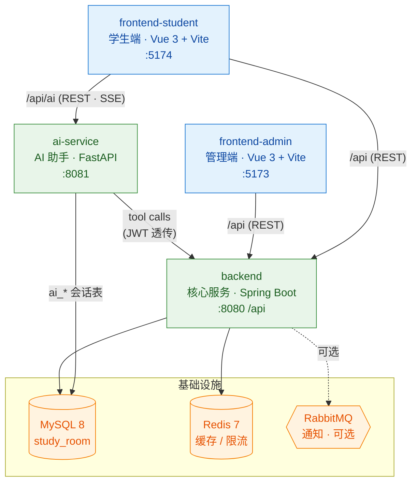

# NookIt · 自习座位预约系统

> 一套面向高校场景的自习座位预约平台，覆盖**学生预约签到**、**管理员运营管理**与**自然语言智能助手**三大场景，采用前后端分离 + 独立 AI 服务的多模块架构。

NookIt 让学生可以在线查询自习室、预约座位、扫码签到，并通过对话式 AI 助手用自然语言完成「明天下午图书馆三楼还有靠窗座位吗」这类查询与预约；同时为管理员提供自习室 / 座位 / 预约 / 违约 / 公告 / 权限的一站式运营后台。

---

## 目录

- [系统架构](#系统架构)
- [模块一览](#模块一览)
- [技术栈](#技术栈)
- [功能特性](#功能特性)
- [快速开始](#快速开始)
  - [环境要求](#环境要求)
  - [1. 启动中间件](#1-启动中间件mysql--redis)
  - [2. 启动后端服务](#2-启动后端服务-backend)
  - [3. 启动 AI 服务](#3-启动-ai-服务-ai-service)
  - [4. 启动前端](#4-启动前端)
- [端口约定](#端口约定)
- [项目结构](#项目结构)
- [开发文档](#开发文档)
- [许可](#许可)

---

## 系统架构

NookIt 由四个相互独立、可单独部署的模块组成：



- **学生端 / 管理端**通过 `/api` 反向代理访问 Java 后端。
- **学生端**的 AI 对话请求经 `/api/ai` 代理到 `ai-service`。
- **ai-service** 校验 JWT 后，将同一个 Token 透传给 Java 后端，以「工具调用」的方式完成业务读写；AI 会话状态（`ai_*` 表）由其直连 MySQL 维护。

## 模块一览

| 模块 | 目录 | 职责 | 技术 |
|---|---|---|---|
| 核心后端 | [`backend/`](backend/README.md) | 认证授权、自习室 / 座位 / 预约 / 签到 / 违约 / 通知 / 公告 / RBAC / 统计 | Spring Boot 3 |
| AI 服务 | [`ai-service/`](ai-service/README.md) | 学生端自然语言助手，工具化调用后端，二段确认写操作、流式输出 | FastAPI |
| 学生端 | [`frontend-student/`](frontend-student/) | 学生 Web 应用：查座、预约、签到、违约申诉、AI 对话 | Vue 3 + Element Plus |
| 管理端 | [`frontend-admin/`](frontend-admin/) | 运营后台：自习室、座位、预约、违约、公告、用户、角色、统计 | Vue 3 + Element Plus |

## 技术栈

| 层级 | 选型 |
|---|---|
| 后端语言 / 框架 | JDK 17 · Spring Boot 3.2 · Spring Security 6 |
| 持久层 | MyBatis-Plus 3.5 · MySQL 8 |
| 缓存 / 锁 | Redis 7 · Redisson |
| 消息队列 | RabbitMQ（通知模块，可选） |
| 鉴权 | JWT（JJWT）· 后端与 AI 服务共享密钥 |
| API 文档 | SpringDoc OpenAPI 2.x（Swagger UI） |
| AI 服务 | Python 3.11+ · FastAPI · OpenAI SDK（默认 DeepSeek）· SQLAlchemy 2.0 async · aiomysql |
| 前端 | Vue 3 · Vite 5 · Vue Router · Pinia · Element Plus · Axios |
| 学生端增强 | Server-Sent Events（流式对话）· marked + DOMPurify（Markdown 渲染） |

## 功能特性

**学生端**

- 自习室 / 座位查询，座位地图可视化，按时段查看空闲情况
- 在线预约与取消，「我的预约」管理
- 扫码 / 编码签到，超时自动判违约
- 违约记录查看与在线申诉
- 公告浏览、意见反馈
- **AI 智能助手**：自然语言查座与预约，流式输出，写操作二段确认（确认卡片）

**管理端**

- 自习室、座位管理（座位支持拖拽摆放布局）
- 预约记录管理，违约处理
- 公告发布、意见反馈处理
- 用户管理、RBAC 角色与权限分配
- 数据看板与统计、系统设置

**AI 服务亮点**

- 工具化 Agent 循环：只读工具直接执行，写操作经前端二段确认后再落库
- 基于 `tool_call_id` 的幂等控制，避免重复创建预约
- SSE 流式输出（token / tool_call / tool_result / confirm_required / final）
- Redis 固定窗口限流，Redis 不可用时自动降级 fail-open
- 长对话滚动摘要，控制上下文长度

## 快速开始

### 环境要求

| 工具 | 版本 |
|---|---|
| JDK | 17+ |
| Maven | 3.8+（或使用自带 `mvnw`） |
| Node.js | 18+ |
| Python | 3.11+ |
| MySQL | 8.x |
| Redis | 7.x |
| Docker | 可选，用于一键起中间件 |

### 1. 启动中间件（MySQL + Redis）

仓库 `work/` 目录提供了 Docker Compose 配置：

```bash
# MySQL（自动初始化 study_room 库）
cd work/mysql && docker compose up -d

# Redis
cd work/redis && docker compose up -d
```

> 数据库结构见 [`backend/src/main/resources/db/init.sql`](backend/src/main/resources/db/init.sql)，使用 Compose 时可放入 `work/mysql/init/` 目录由容器自动执行。

### 2. 启动后端服务 (`backend`)

通过环境变量提供数据库与密钥配置（`application-dev.yml` 中相关项故意留空）：

```bash
export DB_HOST=127.0.0.1 DB_PORT=3306 DB_NAME=study_room
export DB_USERNAME=root DB_PASSWORD=12345678
export REDIS_HOST=127.0.0.1 REDIS_PORT=6379 REDIS_PASSWORD=
export NOOKIT_JWT_SECRET=$(openssl rand -hex 32)   # 需与 ai-service 保持一致

cd backend
./mvnw spring-boot:run
```

启动后监听 `8080`，context-path 为 `/api`。Swagger UI：<http://localhost:8080/api/swagger-ui.html>

详见 [backend/README.md](backend/README.md)。

### 3. 启动 AI 服务 (`ai-service`)

```bash
cd ai-service
python -m venv .venv && source .venv/bin/activate
pip install -e ".[dev]"

cp .env.example .env
# 编辑 .env：填入 LLM_API_KEY、DB_PASSWORD，并保证 NOOKIT_JWT_SECRET 与后端一致

uvicorn app.main:app --host 0.0.0.0 --port 8081 --reload
```

详见 [ai-service/README.md](ai-service/README.md)。

### 4. 启动前端

```bash
# 学生端 (默认 :5174，已配置 /api → 8080、/api/ai → 8081 代理)
cd frontend-student
npm install && npm run dev

# 管理端 (默认 :5173，已配置 /api → 8080 代理)
cd frontend-admin
npm install && npm run dev
```

生产构建：`npm run build`，产物输出至各自的 `dist/`。

## 端口约定

| 服务 | 默认端口 | 说明 |
|---|---|---|
| backend | `8080` | context-path `/api` |
| ai-service | `8081` | 学生端 AI 接口 |
| frontend-admin | `5173` | Vite Dev Server |
| frontend-student | `5174` | Vite Dev Server |
| MySQL | `3306` | 库名 `study_room` |
| Redis | `6379` | 缓存 / 限流 |

## 项目结构

```
NookIt/
├── backend/            # Spring Boot 核心服务（auth / admin / student 模块）
├── ai-service/         # FastAPI AI 助手服务
├── frontend-admin/     # Vue 3 管理端
├── frontend-student/   # Vue 3 学生端
├── docs/               # 需求与迭代文档（用户故事、Sprint 计划）
├── work/               # 本地中间件 Docker Compose（mysql / redis）
└── README.md           # 当前文件
```

## 开发文档

- [用户故事总览](docs/story/README.md) — 角色定义、史诗（E1–E9）与功能索引
- [学生端用户故事](docs/story/student-stories.md)
- [管理端用户故事](docs/story/admin-stories.md)
- [迭代计划](docs/story/sprint-plan.md)
- [后端开发说明](backend/README.md) — 统一响应、异常、错误码、缓存 Key、鉴权约定
- [AI 服务说明](ai-service/README.md) — 工具列表、二段确认、SSE、限流、摘要

## 许可

本项目用于教学 / 课程实践（软件过程管理），如需用于其他用途请联系仓库维护者。
