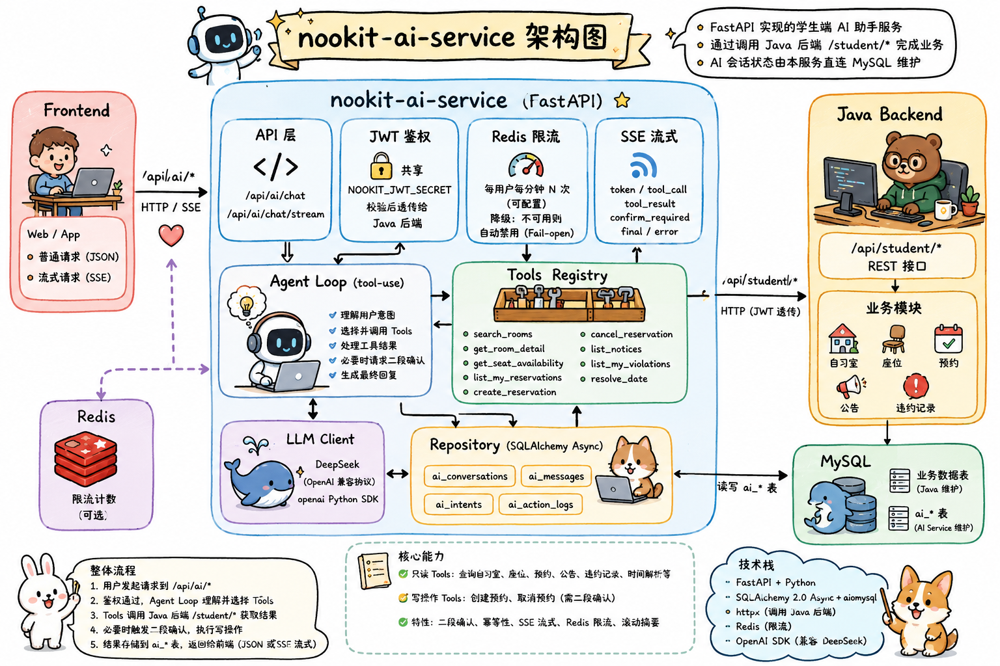
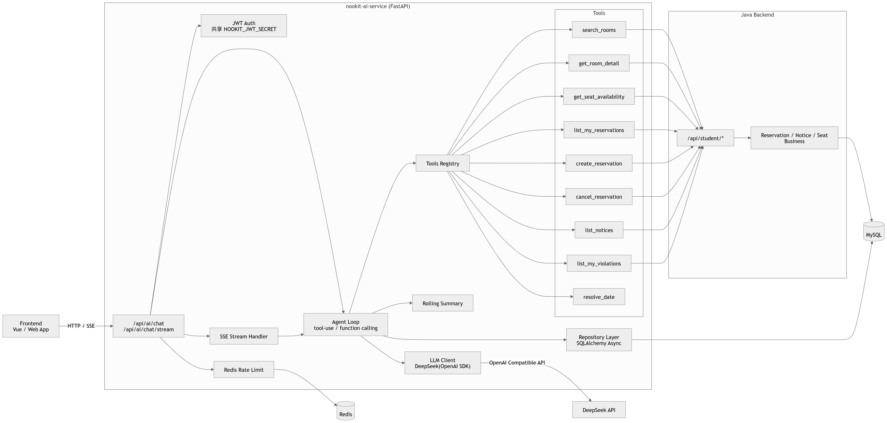

# nookit-ai-service



学生端 AI 助手服务。FastAPI 实现，通过调用 Java 后端的 `/student/*` REST 接口完成业务操作；AI 会话状态（`ai_conversations` / `ai_messages` / `ai_intents` / `ai_action_logs`）由本服务直连 MySQL 维护。

## 架构



- LLM：默认 DeepSeek（OpenAI 兼容协议，使用 `openai` Python SDK）
- 鉴权：与 Java 共享 `NOOKIT_JWT_SECRET`，校验后把同一个 JWT 透传给 Java 调用 tool 接口
- 持久化：`ai_*` 4 张表，SQLAlchemy 2.0 async + aiomysql

## 启动

```bash
cd ai-service
python -m venv .venv && source .venv/bin/activate
pip install -e ".[dev]"

cp .env.example .env
# 编辑 .env 填入 LLM_API_KEY、DB_PASSWORD、NOOKIT_JWT_SECRET

uvicorn app.main:app --host 0.0.0.0 --port 8081 --reload
```

## 自测

```bash
# 1. 走 Java /auth/login 拿一个学生 JWT（示例账号见 init.sql）
TOKEN=$(curl -s -X POST http://127.0.0.1:8080/api/auth/login \
  -H "Content-Type: application/json" \
  -d '{"identity":"20230001","password":"student123"}' | jq -r .data.token)

# 2. 创建会话 + 提问
curl -X POST http://127.0.0.1:8081/api/ai/chat \
  -H "Authorization: Bearer $TOKEN" \
  -H "Content-Type: application/json" \
  -d '{"message":"图书馆三楼明天下午还有靠窗的座位吗？"}'
```

## 实现功能

### 当前工具

**只读 tools**：
- `search_rooms` 自习室列表
- `get_room_detail` 单间详情 + 座位地图
- `get_seat_availability` 座位某天已占用时段
- `list_my_reservations` 我的预约
- `list_notices` 公告
- `list_my_violations` 我的违约记录
- `resolve_date` "明天"/"本周五" → ISO date

**写操作 tools（需前端二段确认）**：
- `create_reservation` 创建预约
- `cancel_reservation` 取消预约

### 二段确认流程

1. LLM 自主决定调 `create_reservation(...)`，agent loop 检测到 `side_effect=True`：
   - 不立即执行
   - 持久化一条 `ai_action_logs` 行（`status=pending`、`idempotency_key=tool_call_id`、`request_json=args`）
   - HTTP 响应返回 `pending_action` 而不是 `reply`

   ```json
   {
     "conversation_id": 123,
     "reply": null,
     "pending_action": {
       "action_id": 456,
       "tool_name": "create_reservation",
       "summary": "创建预约：座位 #5，2026-05-17 14:30-16:00（共 1 小时 30 分钟）",
       "params": {"seatId": 5, "date": "2026-05-17", "startTime": "14:30", "endTime": "16:00"}
     }
   }
   ```

2. 前端用 `summary` + `params` 渲染卡片，用户点"确认"后回调：

   ```bash
   curl -X POST http://127.0.0.1:8081/api/ai/chat \
     -H "Authorization: Bearer $TOKEN" -H "Content-Type: application/json" \
     -d '{"conversation_id": 123, "confirmed_action_id": 456}'
   ```

3. 服务端执行写 tool，更新 action_log 为 success/failed，把 tool 结果喂回 LLM，返回最终 `reply`。

4. 若用户没点确认而是又发了一条普通消息，agent loop 在下一轮开始时会自动把所有 pending action 标记为 `ignored` 并补一条合成 tool result（"用户未确认此操作"），保证 OpenAI 历史合法。

### 幂等性

`ai_action_logs.idempotency_key` 复用 OpenAI 返回的 `tool_call_id`（保证单会话内唯一）。SSE 续传 / 用户重复点击确认按钮时，第二次 confirm 请求会因 `action_status != 'pending'` 直接返回 409，避免重复创建预约。

### SSE 流式 `/api/ai/chat/stream`

- 与 `POST /api/ai/chat` 共用 `ChatRequest`（含 `confirmed_action_id`）
- 返回 `text/event-stream`，事件类型：

  | type | 时机 | 关键字段 |
  |---|---|---|
  | `token` | LLM 每个文本 delta | `text` |
  | `tool_call` | 即将执行某 tool | `name`, `args` |
  | `tool_result` | 读 tool 完成 | `name`, `ok`, 可选 `error` |
  | `confirm_required` | 写 tool 等待用户确认（**流随即结束**） | `action_id`, `tool_name`, `summary`, `params` |
  | `final` | 助手回合干净结束 | `conversation_id` |
  | `error` | 致命错误（**流结束**） | `message` |

  ```bash
  curl -N -X POST http://127.0.0.1:8081/api/ai/chat/stream \
    -H "Authorization: Bearer $TOKEN" -H "Content-Type: application/json" \
    -d '{"message":"图书馆 301 有靠窗座位吗？"}'

  # 看到 confirm_required 后，前端弹卡片让用户确认；点确认后再发：
  curl -N -X POST http://127.0.0.1:8081/api/ai/chat/stream \
    -H "Authorization: Bearer $TOKEN" -H "Content-Type: application/json" \
    -d '{"conversation_id":123, "confirmed_action_id":456}'
  ```

- 实现：`app/agent/loop_stream.py` 重用 `loop.py` 的所有持久化辅助函数（dangling 清理、合成 tool result、idempotency 写入），仅独立实现"OpenAI stream 累积 + token 边收边吐"这一段
- JSON 端点 `/api/ai/chat` 保持原样，不受影响

### Redis 限流

- 配置：`REDIS_HOST` / `REDIS_PORT` / `REDIS_PASSWORD` / `REDIS_DB` / `RATE_LIMIT_PER_MINUTE`（默认 10）
- 算法：每用户固定窗口（60s），`INCR` + 首次写入时 `EXPIRE 70s`
- **降级**：若 `REDIS_HOST` 未配置或连接失败，限流自动禁用，本地无 Redis 也能跑
- Redis 临时不可达视为 fail-open（仅日志告警，不挡用户），避免缓存抖动导致用户请求被无故拒绝
- 触发上限返回 `429`

### 长对话滚动摘要

- 配置：`SUMMARIZE_THRESHOLD_MESSAGES`（默认 30）/ `SUMMARIZE_KEEP_RECENT`（默认 20）/ `SUMMARIZE_MIN_NEW_MESSAGES`（默认 10）
- 触发时机：每轮 `run_turn` / `resume_from_action` 末尾
- 触发条件：会话总消息数 ≥ 阈值 **且** 自上次摘要以来"老消息"≥ `SUMMARIZE_MIN_NEW_MESSAGES`
- 摘要存到 `ai_conversations.context_json`：
  ```json
  {
    "summary": "学生想找图书馆靠窗座位，AI 已查询 LIB-301 并推荐 A03 ...",
    "summarized_through_id": 142,
    "summarized_at": "2026-05-16T14:30:00"
  }
  ```
- 下一轮 LLM 调用时：加载 `summary` 作为第二条 system 消息 + 所有 `id > summarized_through_id` 的近期消息

## Todo

- 更细粒度的限流（例如分用户类型、按时间段加权）
- 摘要质量评估 / 失败重试
- WebSocket / 多消息广播

## 目录

```
app/
├── main.py                  FastAPI 入口
├── config.py                pydantic-settings 读取 .env
├── auth.py                  JWT 解码
├── db.py                    SQLAlchemy async engine/session
├── models.py                ai_* 表 ORM
├── http_client.py           httpx + JWT 透传
├── routes/
│   ├── chat.py              POST /ai/chat
│   └── conversations.py     GET /ai/conversations, /messages
└── agent/
    ├── loop.py              tool-use 主循环
    ├── prompts.py
    ├── registry.py          tool 注册
    ├── repo.py              ai_* 表读写
    └── tools/
        ├── base.py
        ├── rooms.py
        ├── reservations.py
        ├── notices.py
        ├── violations.py
        └── time_utils.py
```
